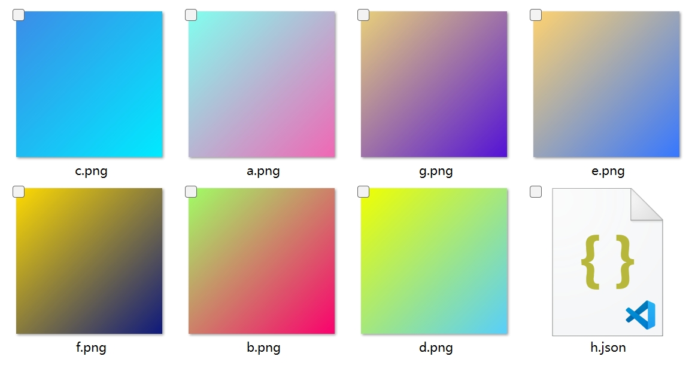
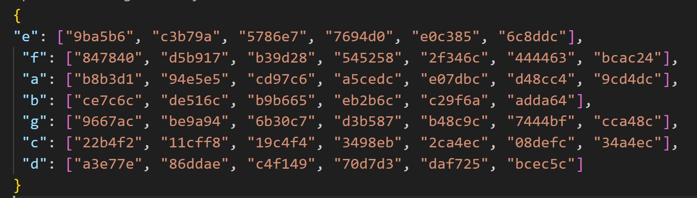
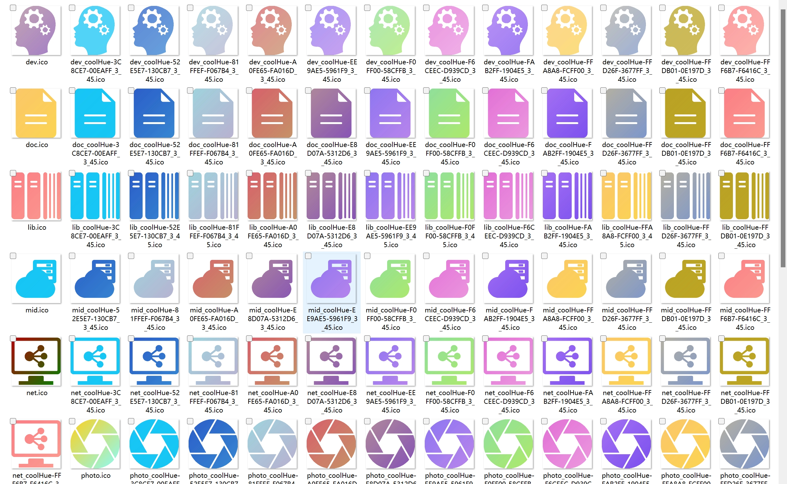
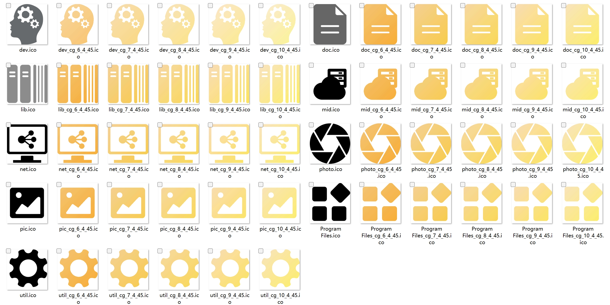

# mineToys

mineToys is a small program developed in Scala for Windows, which supports interactive command line and direct
invocation by java -jar command.

```shell
__  __ _       _   _____     _   _  _____         _   _
|  \/  (_)     | | |_   _|   | | | ||_   _|       | | | |
| \  / |_ _ __ | |_  | | ___ | |_| |  | | ___  ___| |_| |
| |\/| | | '_ \| __| | |/ _ \| __| |  | |/ _ \/ __| __| |
| |  | | | | | | |_  | | (_) | |_|_|  | |  __/\__ \ |_|_|
|_|  |_|_|_| |_|\__| \_/\___/ \__(_)  \_/\___||___/\__(_)
```

## Introduction

mineToys is a collection of useful and fun tools for audio and icon processing. You can use it to convert, cut, split,
fill, and transform your audio and icon files with simple commands. You can also use it to test your Scala skills and
learn some new tricks.

## Features

- audio

| Parameter | Description                                                                                                                                                                                                                                                                                              |
|-----------|----------------------------------------------------------------------------------------------------------------------------------------------------------------------------------------------------------------------------------------------------------------------------------------------------------|
| mew       | The mp4 file or folder to be exported; the maximum length (minutes) of a single audio file to be exported. If a folder is entered, all mp4 files in the folder will be exported as audio files with the same name. If the mp4 file is longer than the set maximum length, it will be split and exported. |
| sw        | The specified audio file address; the length (minutes) to be cut. The specified audio file will be cut into fixed lengths.                                                                                                                                                                               |
| wtt       | The folder of the sound. Use funasr to convert wav to text file (need to start local funasr service).                                                                                                                                                                                                    |

- icon

| Parameter | Description                                                                                                                                                                                                                                                      |
|-----------|------------------------------------------------------------------------------------------------------------------------------------------------------------------------------------------------------------------------------------------------------------------|
| edc       | The input image file (folder); the output format; the output type. The output format can be (json, scala), the output type can be ($text file specified path, print).                                                                                            |
| fi        | icon_path; color_path; color_num; degree. Fill the non-transparent part of the icon with color.                                                                                                                                                                  |
| sci       | icon_file; fill color hex value; output file suffix. Fill the non-transparent part of the icon with pure color.                                                                                                                                                  |
| ic        | target format; input; output. Convert svg image to png or png format.                                                                                                                                                                                            |
| sito      | The folder where the icon is located; the folder whose icon needs to be set. Use the icon in the specified folder to set the icon of the subordinate folder of the given folder. The requirement is that it must be a folder and have the same name as the icon. |

- test

| Parameter | Description                                                  |
|-----------|--------------------------------------------------------------|
| hello     | name. Test program for demonstrating the use of the program. |

## Installation

- Download `mineToy.exe` from [here](https://github.com/eterk/MineToys/releases/tag/exe).
- Save it to your preferred location.
- Double-click it to run it.

## Usage

- Interactive command line

   - Open a terminal window and navigate to the location where you saved `mineToy.exe`.
   - Type `mineToy.exe` and press enter to start the program.
   - Try the following commands:

  ```shell

  -lang:en # Set the application to English

  -l:all # Show all applications

  -e:hello;user # Execute the test project and output hello, user!

  -help:mew # View the help of mew

  -g:audio # Set the current application group to audio

  -d:1 # Turn on debug log
  #Enter -g:${application group name} -e:${application name};parameter one;parameter; in the command line
  -e:mew;D:\\lib\\video;10
  # Execute the mew application; export the mp4 files in the `D:\\lib\\video` folder as wav audio files of 10 minutes per segment
  ```

- Direct invocation by java -jar command

   - Make sure you have Java installed on your system. You can check it by typing `java -version` in a terminal window.
     If you don't have Java, you can download it from [here](https://www.java.com/en/download/).
   - Open a terminal window and navigate to the location where you saved `mineToy.exe`.
   - Type `java -jar mineToy.exe -g:${application group name} -e:${application name};parameter one;parameter;` and
     press enter to execute the program with the specified parameters. For example:

  ```shell
  java -jar mineToy.exe -g:audio -e:mew;D:\\lib\\video;10
  # Execute the mew application; export the mp4 files in the `D:\\lib\\video` folder as wav audio files of 10 minutes per segment
  ```

## Screenshots

Here are some screenshots of the program in action:

### `mew` export wav from .mp4 file with fix length

### `edc` export dominate color of .jpg or .png file from an dir




### `fi` fill icon with colorful




## References

- [Scala](https://www.scala-lang.org/)
- [launch4j](http://launch4j.sourceforge.net/)
- [funasr](https://github.com/funasr/funasr)
- [scopt](https://github.com/scopt/scopt)
- [jline](https://github.com/jline/jline3)
- [GitHub Copilot](https://copilot.github.com/)

## License

This project is licensed under the MIT License - see
the [LICENSE](https://github.com/mineToy/mineToy/blob/master/LICENSE) file for details.